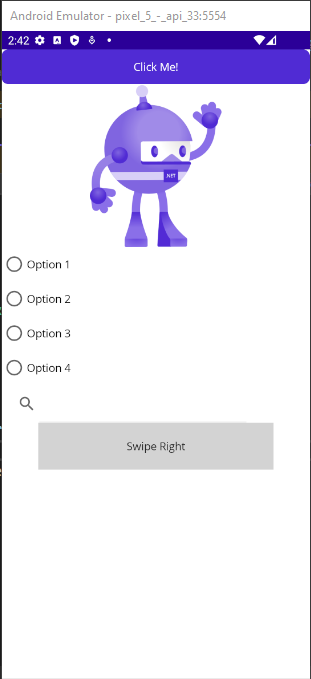
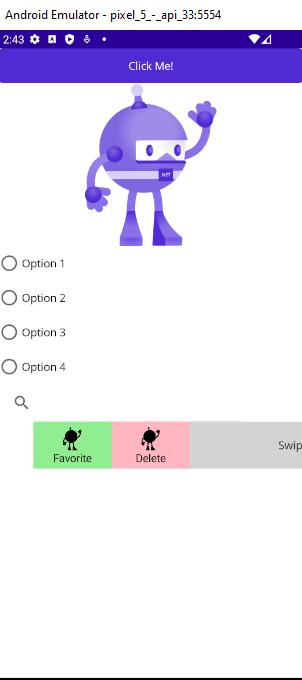
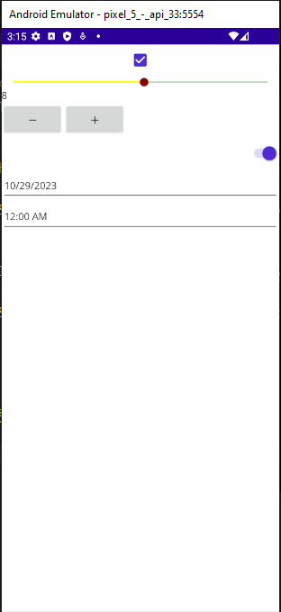
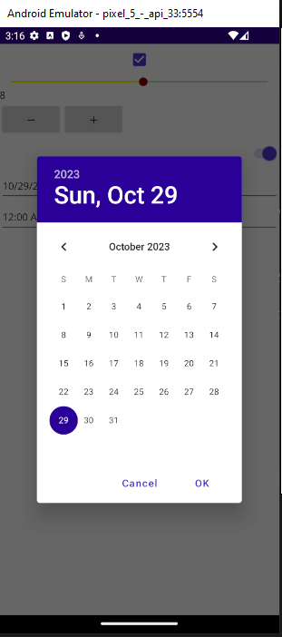
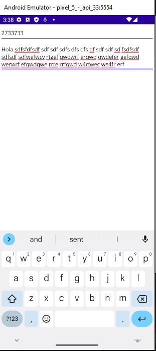

# https://www.udemy.com/course/curso-net-maui/

# Combinaciones de teclas
* F7 - Navegamos al code design

# Proyecto1 - Controles de presentacion

* Control ``<BoxView/>``

  * Nos va a servir para cuando queramos colocar algun tipo de fondo en la aplicacion, o cuando queramos llevar a cabo la separacion entre 2 secciones diferentes
* ``<Label/>``

  * Desplegar informacion al usuario
  * Para el atributo de FontSize tiene valores preestablecidos como
    * Body
    * Header
    * Large
    * etc
    * o una establecer un valor, la ventaja es que
      cada valor se acopla automaticamente al tipo
      de dispositivo.
* ``<Elipse/>``

  * Es utilizado cuando quieramos desplegar algun tipo de elipse, ya sea si queremos mostrar un perfil de usuario,
    algun tipo de grafica
    * Atributo `Fill` determinamos el relleno de ese elipse
    * `Stroke` determinamos el contorno
    * `StrokeThickness` el grosor del contorno.


* ``<Rectangle/>``
* ``<Polygon/>``
  * Estos puntos los tenemos en par de coordenadas dados por
    * Coordenada en X, Coordenada en Y
    * 40, 10
    * 70, 80
    * 10, 50
* `<Polyline/>`


* Para agregar una barra de desplazamiento lo hacemos con
  * `<ScrollView>`
    

****

* ``<Path/>`` Debemos especificar un conjunto diferente de informacion
* ``<Border/>`` Nos va a permitir agregar un borde a cualquier elemento grafico
* ``<Frame/>`` Pone el contenido en un formato tipo targeta


* ``<WebView/>`` Nos va a permitir colocar una URL para mostrar un sitio web
  

```xaml
<!--************************************************-->
<ScrollView>
    <VerticalStackLayout>
        <!--********************************************-->
        <BoxView BackgroundColor="Black"
             HeightRequest="200"
             />
        
        <!--********************************************-->
        <Label Text="XAMARIN" TextColor="Black"
           FontAttributes="Bold"
           FontSize="Large"
           HorizontalTextAlignment="Center"
        />

        <!--********************************************-->
        <Ellipse Fill="DarkRed"
             Stroke="DarkGreen"
             StrokeThickness="10"
             HeightRequest="200"
             HorizontalOptions="Center"  
             WidthRequest="200"
        />

        <!--********************************************-->
        <Line Stroke="Black"
          X1="0" Y1="0" X2="100" Y2="50"
          StrokeThickness="10"
          HorizontalOptions="Center"
          />

        <!--********************************************-->
        <Rectangle Fill="DarkRed"
               Stroke="Black"
               StrokeThickness="5"
               HeightRequest="50"
               HorizontalOptions="End"
               WidthRequest="150"
               RadiusX="10"
               RadiusY="10"
               />

        <!--********************************************-->
        <Polygon Fill="LightBlue"
             Points="40,10 70,80 10,50"
             Stroke="DarkBlue"
             StrokeThickness="5"
             />

        <!--********************************************-->
        <Polygon Fill="Yellow"
             Points="40,10 70,80 10,50"
             Stroke="DarkBlue"
             StrokeDashArray="1,1"
             StrokeDashOffset="6"
             StrokeThickness="5"
            />

        <!--********************************************-->
        <Polyline Points="0,0 10,30 15,0 18,60 23,30 
              35,30 40,0 43,60 48,30 100,30"
              Stroke="Red"
              />

        <!--********************************************-->
        <Polyline Points="0 48, 0 144, 96 150"
                  Fill="Blue"
                  Stroke="Red"
                  StrokeThickness="3"
                  />

        <!--********************************************-->
        <Polyline Points="0 48, 0 144, 96 150, 100 0, 192 0, 
                  192 0, 192 96, 50 96, 48 192, 150 200, 144 48"
              Fill="Blue"
              Stroke="Red"
              StrokeThickness="3"
              />

        <!--********************************************-->
        <Path Aspect="Uniform"
              Data="M 10,100 L 100,100 100,50Z"
              HorizontalOptions="Center"
              Stroke="Black"
            />

        <!--********************************************-->
        <Border Stroke="#C49B33"
                StrokeThickness="4"
                Background="#2B0B98"
                Padding="16,8"
                HorizontalOptions="Center"
                >
            <Border.StrokeShape>
                <RoundRectangle CornerRadius="40, 0, 0, 40"/>
            </Border.StrokeShape>
            <Label Text="Welcome to .NET MAUI!"
                   VerticalOptions="Center"
                   HorizontalOptions="Center"
                   TextColor="White"
            />
        </Border>

        <!--********************************************-->
        <Frame Margin="5"
               BackgroundColor="Azure"
               Padding="10">
            <Image Source="dotnet_bot.svg"/>
        </Frame>

        <!--********************************************-->
        <WebView HeightRequest="500"
                 Source="https://academia.elcamino.dev/"
            />
    </VerticalStackLayout>
</ScrollView>
```

# Video 28  Controles que inician comandos

* `<Button/>`
    * Con `DisplayAlert("Test", "This is a demo", "Ok");` desplegamos una alerta.
* `<ImageButton/>`
* `<RadioButton/>`





```xaml
<VerticalStackLayout>
    <!--************************************************-->
    <Button x:Name="btnTest" 
            Text="Click Me!"
            Clicked="btnTest_Clicked"
            />

    <!--************************************************-->
    <ImageButton Source="dotnet_bot.svg"
                 Clicked="btnTest_Clicked"
                 />
    
    <!--************************************************-->
    <RadioButton CheckedChanged="RadioButton_CheckedChanged"
                 Content="Option 1" GroupName="gp1"/>
    <RadioButton CheckedChanged="RadioButton_CheckedChanged"
         Content="Option 2" GroupName="gp1"/>
    <RadioButton CheckedChanged="RadioButton_CheckedChanged"
         Content="Option 3" GroupName="gp2"/>
    <RadioButton CheckedChanged="RadioButton_CheckedChanged"
         Content="Option 4" GroupName="gp2"/>

    <!--************************************************-->
    <SearchBar x:Name="searchControl"
               SearchButtonPressed="searchControl_SearchButtonPressed"
        />

    <!--************************************************-->
    <SwipeView>
        <SwipeView.LeftItems>
            <SwipeItems>
                <SwipeItem BackgroundColor="LightGreen"
                           IconImageSource="dotnet_bot.svg"
                           Invoked="SwipeItem_Invoked"
                           Text="Favorite"
                />
                <SwipeItem BackgroundColor="LightPink"
                           IconImageSource="dotnet_bot.svg"
                           Invoked="SwipeItem_Invoked"
                           Text="Delete"
                />
            </SwipeItems>
        </SwipeView.LeftItems>
        <Grid BackgroundColor="LightGray"
              HeightRequest="60"
              WidthRequest="300">
            <Label HorizontalOptions="Center"
               Text="Swipe Right"
               VerticalOptions="Center"/>
        </Grid>
    </SwipeView>
</VerticalStackLayout>
```

Codigo C#
```c#
    private void btnTest_Clicked(object sender, EventArgs e)
    {
    	DisplayAlert("Test", "This is a demo", "Ok");
    }
    
    private void RadioButton_CheckedChanged(object sender, CheckedChangedEventArgs e)
    {
        DisplayAlert("Test", $"Changed: {e.Value}", "Ok");
    }
    
    private void searchControl_SearchButtonPressed(object sender, EventArgs e)
    {
        DisplayAlert("Searching", $"Searching: {searchControl.Text}", "Ok");
    }
    
    private void SwipeItem_Invoked(object sender, EventArgs e)
    {
        DisplayAlert("SwipeView", $"Element Tapped", "Ok");
    }
```

# Video 29 Controles para establecer valores

* `<CheckBox/>`
* `<Slider/>`
* `<Stepper/>`
* `<Switch/>`
* `<DatePicker/>`
* `<TimePicker/>`





XAML
```xaml
<VerticalStackLayout>
    <!--*********************************************-->
    <CheckBox IsChecked="True"/>

    <!--*********************************************-->
    <Slider x:Name="slider"
            Minimum="0"
            Maximum="10"
            MinimumTrackColor="Yellow"
            MaximumTrackColor="Green"
            ThumbColor="DarkRed"
                ValueChanged="slider_ValueChanged"/>

    <Label x:Name="lblSlider"/>
    
    <!--*********************************************-->
    <Stepper x:Name="stepper"
             ValueChanged="stepper_ValueChanged"
             Maximum="10"
             Minimum="2"
             Increment="2"/>
    
    <!--*********************************************-->
    <Switch IsToggled="True"/>

    <!--*********************************************-->
    <DatePicker/>
    <TimePicker/>
    
</VerticalStackLayout>
```

Codigo C#
```c#
private void slider_ValueChanged(object sender, ValueChangedEventArgs e)
{
	lblSlider.Text = slider.Value.ToString();
}

private void stepper_ValueChanged(object sender, ValueChangedEventArgs e)
{
    if (
        stepper != null
        )
    {
        lblSlider.Text = stepper.Value.ToString();
    }
}
```

# Video 30 Controles de edicion de texto

* `<Entry/>`
* `<Editor/>`



Etiquetado XAML
```xaml
<VerticalStackLayout>
    <!--*********************************************-->
    <Entry 
           x:Name="txtName"
           Placeholder="Name"
           PlaceholderColor="DarkGreen"
           IsPassword="True"
           Keyboard="Telephone"
           TextChanged="Entry_TextChanged"
           Completed="Entry_Completed"/>

    <!--*********************************************-->
    <Editor AutoSize="TextChanges"/>
    
</VerticalStackLayout>
```

Codigo C#
```c#
private void Entry_TextChanged(object sender, TextChangedEventArgs e)
{
    Debug.WriteLine(txtName.Text);
}

private void Entry_Completed(object sender, EventArgs e)
{
    DisplayAlert("Test", "Se ah completado", "Ok");
}
```