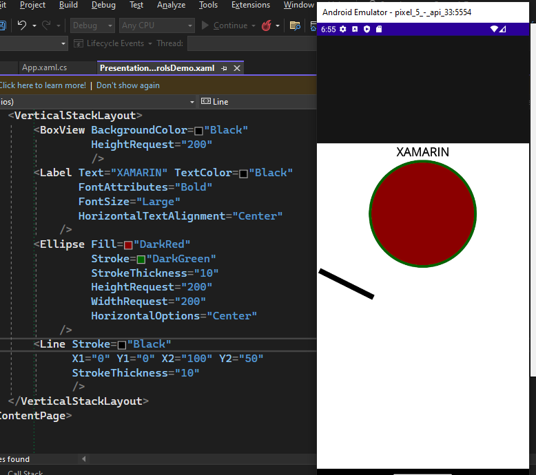
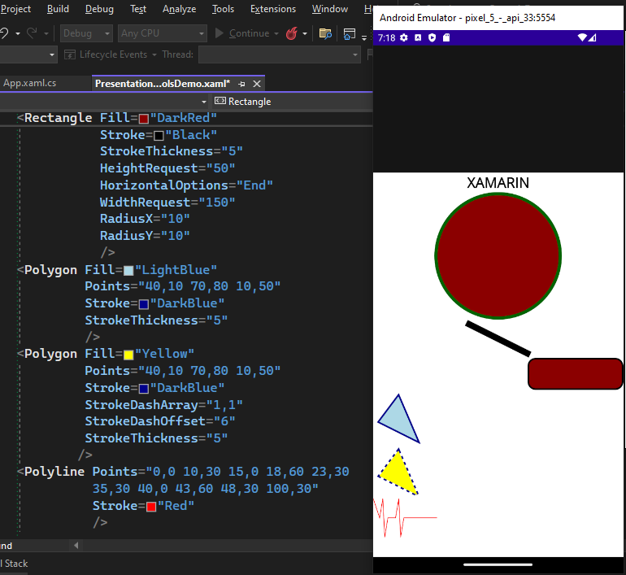
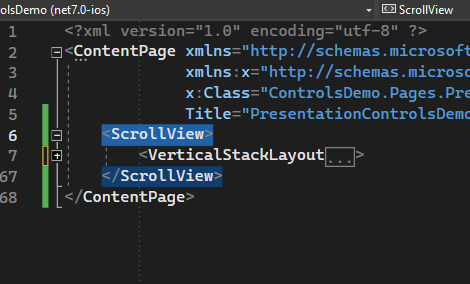
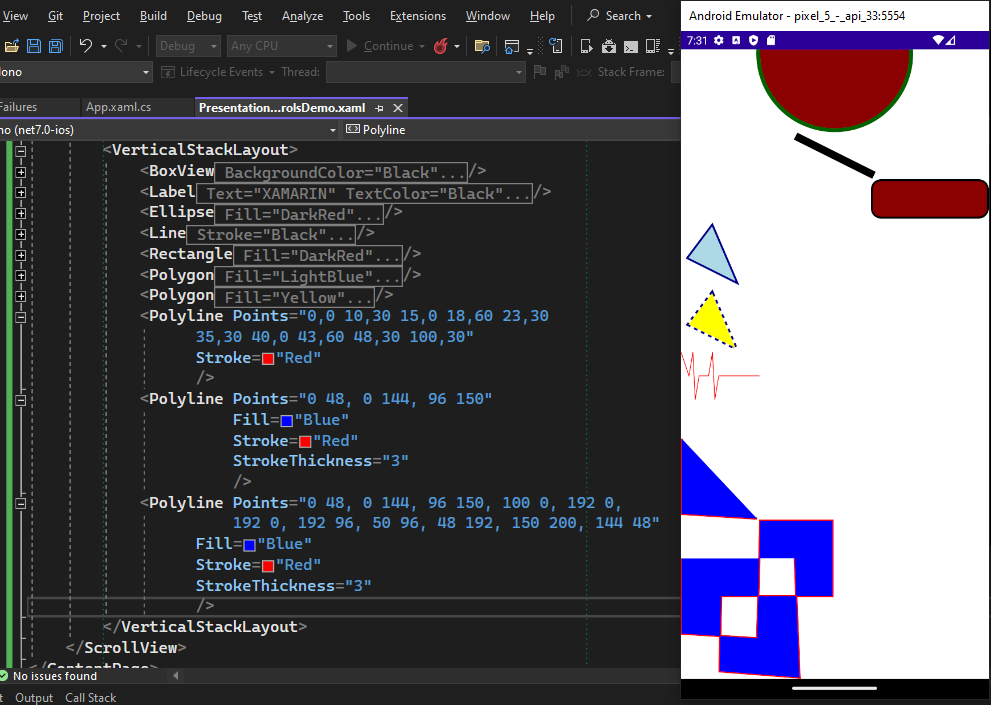
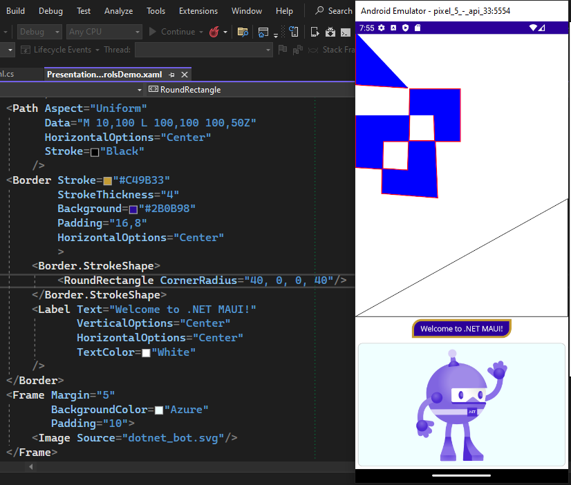
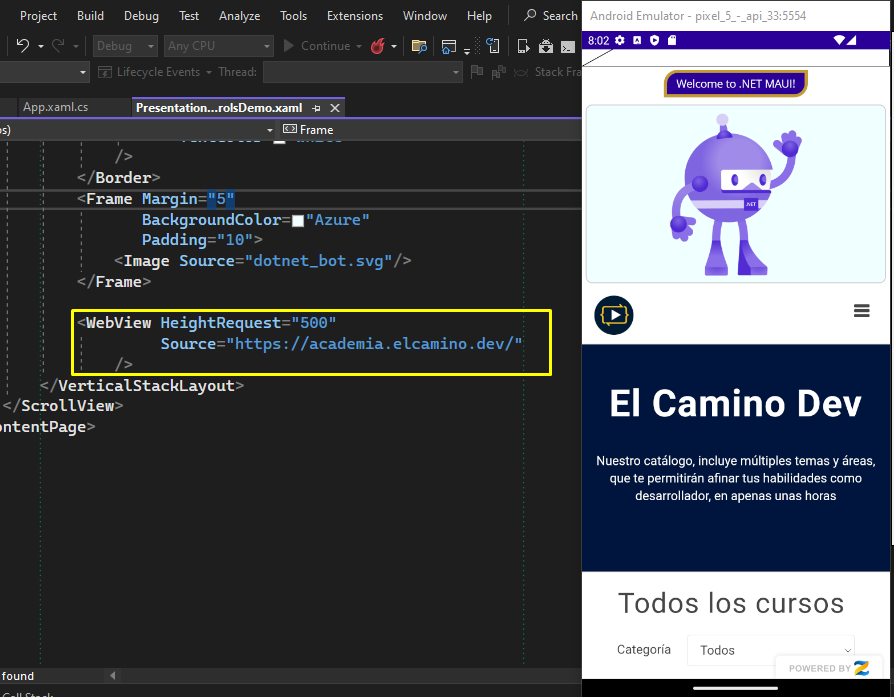

# https://www.udemy.com/course/curso-net-maui/

# Proyecto1 - Controles de presentacion

* Control ``<BoxView/>``

  * Nos va a servir para cuando queramos colocar algun tipo de fondo en la aplicacion, o cuando queramos llevar a cabo la separacion entre 2 secciones diferentes
* ``<Label/>``

  * Desplegar informacion al usuario
  * Para el atributo de FontSize tiene valores preestablecidos como
    * Body
    * Header
    * Large
    * etc
    * o una establecer un valor, la ventaja es que
      cada valor se acopla automaticamente al tipo
      de dispositivo.
* ``<Elipse/>``

  * Es utilizado cuando quieramos desplegar algun tipo de elipse, ya sea si queremos mostrar un perfil de usuario,
    algun tipo de grafica
    * Atributo `Fill` determinamos el relleno de ese elipse
    * `Stroke` determinamos el contorno
    * `StrokeThickness` el grosor del contorno.

* ``<Rectangle/>``
* ``<Polygon/>``
  * Estos puntos los tenemos en par de coordenadas dados por
    * Coordenada en X, Coordenada en Y
    * 40, 10
    * 70, 80
    * 10, 50
* `<Polyline/>`

* Para agregar una barra de desplazamiento lo hacemos con
  * `<ScrollView>`
    

****

* ``<Path/>`` Debemos especificar un conjunto diferente de informacion
* ``<Border/>`` Nos va a permitir agregar un borde a cualquier elemento grafico
* ``<Frame/>`` Pone el contenido en un formato tipo targeta

* ``<WebView/>`` Nos va a permitir colocar una URL para mostrar un sitio web
  
